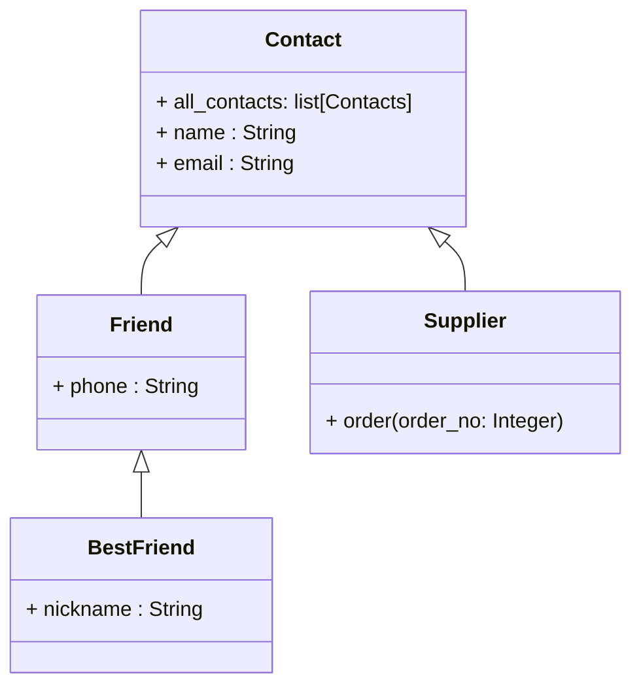

# Extend Parent Class
When we say a child class ___“extends”___ (i.e., inherits from) a parent class, it can:  
- Add New Behavior (New Methods)
- Add New Data (New Attributes)
- Override Existing Behavior
- Extend Parent’s Behavior

We will walk through each of these in the following example.

<br>

### Step 0: Create a Base Class

Write a class named `Contact` that represents a generic contact. This will be the base/parent class that other classes inherit from.

This class should have the following:

- Class variable: `all_contacts` - a list that stores all instances (and instances of any subclasses).

- `__init__` method that:
  - Stores `name` and `email` as instance variables.
  - Appends the newly created object to `all_contacts`.

- `__str__` method that returns the contact's information in the format 

    ```
    <name>, <email>
    ```

---
__Solution__
  
```python
class Contact:
  all_contacts = []

  def __init__(self, name: str, email: str):
    self.name = name
    self.email = email
    Contact.all_contacts.append(self)

  def __str__(self):
    return f"{self.name}, {self.email}"

c1 = Contact("Dusty", "dusty@example.com")
c2 = Contact("Steve", "steve@itmaybeahack.com")

for c in Contact.all_contacts:
  print(c)
```


> What would be the output?

---

<br>

### Step 1: Create a Derived Class that Adds New Behavior

   ☑️: Adds new instance variables
   
   ☑️: Parent does not have this data

Now create a class named `Supplier` that inherits from (extends) the `Contact` class.

This class should:
- Inherit all attributes and methods from `Contact` without modifying the constructor.
- Add a new method named `order(order_no: int)`. It should print a message in the following format:
```
Order <order_no> sent to <name>
```

---

__Solution__

```python
class Supplier(Contact):
  def order(self, order_no: int):
    print(f"{order_no} order to {self.name}")

s1 = Supplier("Eddy", "eddy@hellfireclub.com")
```

__Description__

Here `s1`(`Supplier`) has:

- __TWO__ instance attributes:
   1. `name`
   2. `email`
- __ONE__ class attribute: `all_contacts`
- __THREE__ methods:
   1. `__init__` $\rightarrow$ from parent
   2. `__str__` $\rightarrow$ from parent
   3. `order` $\rightarrow$ from intself
---

<br>

### Step 2: Create a Derived Class that Adds New Data

☑️: New functionality

☑️: Does not change parent behavior

Next, create a class `Friend` that also inherits from `Contact`. 
- Add a new instance attribute named `phone` to store the friend’s phone number.

---

__Solution__

```python
class Friend(Contact):
  def __init__(self, name, email, phone):
    super().__init__(name, email)
    self.phone = phone

f1 = Friend("bunny", "bunny@hellfireclub.com", 100300555)
```

__Description__

Here `f1`(`Friend`) has:

- __THREE__ instance attributes:
   1. `name` $\rightarrow$ from parent
   2. `email` $\rightarrow$ from parent
   3. `phone` $\rightarrow$ from itself
- __ONE__ class attribute: `all_contacts`
- __TWO__ methods:
   1. `__init__` $\rightarrow$ from itself
   2. `__str__` $\rightarrow$ from parent
---

<br>

### Step 3: Override Existing Behaviour of Parent

☑️: Same method name

☑️: Different implementation

Create a new `__str__` method in `Friend` so that it overrides the `__str__` method in `Contact` and returns:
  ```
  <name>, <email>, <phone>
  ```

---

__Solution__

```
class Friend(Contact):
  def __init__(self, name, email, phone):
    super().__init__(name, email)
    self.phone = phone

  def __str__(self):
    return f"{self.name}, {self.email}, {self.phone}"

f = Friend("Dusty", "Dusty@private.com", "555-1212")

for c in Contact.all_contacts:
  print(c)
```

> What would be the output?

---

<br>

### Step 4: Extend Parent's Behaviour with `super()`

☑️: Reuses parent behavior

☑️: Adds additional functionality

Now create a class `BestFriend` that inherits from `Friend`. This gives you 3 levels of inheritance:

```
Contact  —>  Friend  —>  BestFriend
```

This new class should:

- Add new data: a new attribute `nickname`.

- Extend the `__str__` method (extend the parent's behaviour) using `super()` instead of replacing it completely.
    - First, call `__str__` using `super()` to get the string from `Friend`.
    - Then add `" [nickname: <nickname>]"` to the end.
    - The new `__str__` should be in the format:
      ```
      <name>, <email>, <phone> [nickname: <nickname>]
      ```

---

__Solution__

```
class BestFriend(Friend):
  def __init__(self, name, email, phone, nickname):
    super().__init__(name, email, phone)
    self.nickname = nickname

  def __str__(self):
    return super().__str__() + f" [nickname: {self.nickname}]"

bf = BestFriend("Alice", "alice@example.com", "555-9999", "Ally")

for c in Contact.all_contacts:
  print(c)
```

> What would be the output?

---

<br>

### UML Diagram of the Given Example

